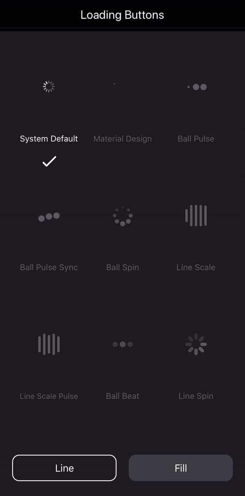
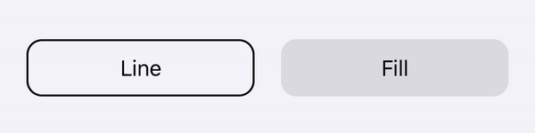
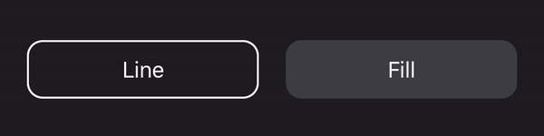
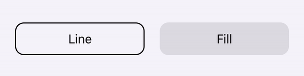
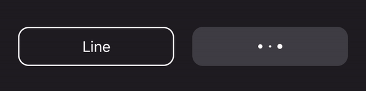
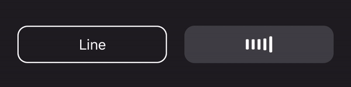
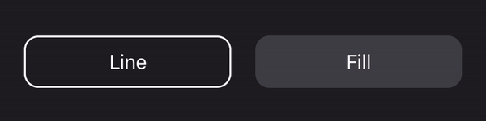

# Loading Buttons
A collection of loading buttons and their styling written in Swift.

[](https://shields.io/) [](https://shields.io/)  [](https://shields.io/)  [](https://shields.io/) 

You may see the following [Medium](https://medium.com/) article for detailed explanation of creating loading buttons.

- [Create Loading Buttons in iOS using Swift](https://medium.com/@twho/create-loading-buttons-in-ios-using-swift-63ec77eebda?sk=8f69e9a7760cabacde096c34cc416f95)

| Light mode |  Dark mode |
|:--:| :--:|
|  |   | 

## Key Features
- The example gives you **9** choices of loading indicators with the loading button. 
- The **IndicatorProtocol** clearly defines the functions and properties. You can refer to it and customize your own.
- The **LoadingButton** class is made to be **open**, from which you can easily inherit and create your own.

## Requirements
- Swift 5.0
- iOS 11.0+

## Installation
### CocoaPods
LoadingButtons project is available via [CocoaPods](http://cocoapods.org). To install it, simply add the following line to your Podfile:

```
$ pod 'MHLoadingButton'
```

### Swift Package Manager
Add LoadingButtons as dependency in your `Package.swift`

```swift
import PackageDescription

let package = Package(
    name: "YourPackage",
    dependencies: [
        .Package(url: "https://github.com/twho/loading-buttons-ios.git", majorVersion: 0),
    ]
)
```

If you don't use CocoaPods or Swift Package Manager, you can download the entire project then import all the source files and use them in your project.

## Usage
### Declaration
```swift
// The frame is default to zero. You need to use AutoLayout to resize it. 
// Otherwise, you can specify the frame in initializer.
if #available(iOS 13.0, *) {
    // This is the new initializer for iOS 13 dark/light mode. 
    // The syste colors will be used.
    btnLoading = LoadingButton(text: "Button", buttonStyle: .outline) // Outlined button
    btnLoading = LoadingButton(text: "Button", buttonStyle: .fill)    // Filled button
} else {
    // Custom color initializer
    btnLoading = LoadingButton(text: "Button", textColor: .black, bgColor: .white)
}

```
### System Default 
```swift
btnLoading.indicator = UIActivityIndicatorView()
```
| Light mode |  Dark mode |
|:--:| :--:|
|  |  | 

### Material Design
```swift
btnLoading.indicator = MaterialLoadingIndicator(color: .gray)
```
| Light mode |  Dark mode |
|:--:| :--:|
|  |  | 

### Ball Pulse
```swift
btnLoading.indicator = BallPulseSyncIndicator(color: .gray)
```
| Light mode |  Dark mode |
|:--:| :--:|
|  |  | 

### Ball Pulse Sync
```swift
btnLoading.indicator = BallSpinFadeIndicator(color: .gray)
```
| Light mode |  Dark mode |
|:--:| :--:|
|  |  | 

### Ball Spin
```swift
btnLoading.indicator = LineScalePulseIndicator(color: .gray)
```
| Light mode |  Dark mode |
|:--:| :--:|
|  |  | 

### Line Scale
```swift
btnLoading.indicator = LineScaleIndicator(color: .gray)
```
| Light mode |  Dark mode |
|:--:| :--:|
|  |  | 

### Line Scale Pulse
```swift
btnLoading.indicator = BallPulseIndicator(color: .gray)
```
| Light mode |  Dark mode |
|:--:| :--:|
|  |  | 

### Ball Beat
```swift
btnLoading.indicator = BallBeatIndicator(color: .gray)
```
| Light mode |  Dark mode |
|:--:| :--:|
|  |  | 

### Line Spin
```swift
btnLoading.indicator = LineSpinFadeLoader(color: .gray)
```
| Light mode |  Dark mode |
|:--:| :--:|
|  |  | 

## Credits
* [Material Design](https://material.io/design/)
* [Material Design Widgets Lite](https://github.com/twho/material-design-widgets-lite-ios)
* [Le Van Nghia](https://github.com/sharad-paghadal/MaterialKit/tree/master/Source)
* [ninjaprox](https://github.com/ninjaprox/NVActivityIndicatorView)
